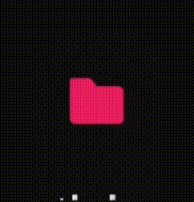

# 🖌 Semantic Colors

**HEADER\_PRIMARY** : The primary color for headers, such as channel and server names (also for settings page text and profiles)





***

* **HEADER\_SECONDARY** : The secondary color for headers, such as channel and server names (also for settings page text and profiles, status, user tags)



***

* **TEXT\_NORMAL** : The color for regular text in chat
* **TEXT\_MUTED** : The color for muted text, also for time stamps in chat, texts in search bar, text in settings page (channels, vendetta), changes the send icon button if chat box is empty & some loading elements.





***

* **TEXT\_LINK** : The color for links in chat



***

* **INTERACTIVE\_NORMAL** : The color for interactive elements, such as buttons in settings page and bottom bar.





***

* **INTERACTIVE\_HOVER** : The color for interactive elements when hovered over
* **INTERACTIVE\_ACTIVE** : The color for interactive elements when clicked or activated like active or unread channels and selected buttons in bottom bar, names in friend lists





***

* **INTERACTIVE\_MUTED** : Interactive Muted: The color for inactive interactive elements like muted channels.
* **BACKGROUND\_PRIMARY** : The primary background color for the UI, navigation bar, channel background for tabV2





***

* **BACKGROUND\_SECONDARY** : The secondary background color for the UI, background of create new server icons and stuffs, settings embed of plugins and themes, some elements in forum pages





***

* **BACKGROUND\_SECONDARY\_ALT** : Chat Input background \[Add Files, Gift Buttons], Emoji/GIF/Sticker slider background.



***

* **BACKGROUND\_TERTIARY**: Global Border background when elements are slide out \[Server List, User List], Search Bar background, top bar separator when in channel.





***

* **BACKGROUND\_ACCENT**: Reply Pipe, Edit user Profile button, Album Buttons, Thread Buttons, Invite server button background in channel list.





***

* **BACKGROUND\_FLOATING**: Profile Top background, Server Boost Page Icons



***

* **BACKGROUND\_NESTED\_FLOATING**: Settings buttons/boxes background (ios)
* **BACKGROUND\_MOBILE\_PRIMARY**: Account/Settings background



***

* **BACKGROUND\_MOBILE\_SECONDARY**: Channel List/DM Background, Global Header Color





***

* **BACKGROUND\_MESSAGE\_HOVER**: The color for interactive elements when hovered over
* **BACKGROUND\_MODIFIER\_HOVER**: Background color of slash commands



***

* **BACKGROUND\_MODIFIER\_ACTIVE**: Background color of clyde message and some other elements, selected server emotes





<figure><figcaption></figcaption></figure>

***

* **BACKGROUND\_MODIFIER\_SELECTED**: Background color of selected User or Channel



***

* **BACKGROUND\_MODIFIER\_ACCENT**: Separators \[Server List Top, Bottom Bar, Server Info, User List, User Info, @, Notifications, Friends, Search, Settings]



* **BG\_BACKDROP**:
Colour of context menus 

* **BG\_BASE\_SECONDARY**:
Settings pages for light mode

***

* **SCROLLBAR\_THIN\_THUMB**: Elements of scroll bars
* **SCROLLBAR\_THIN\_TRACK**: Elements of scroll bars
* **SCROLLBAR\_AUTO\_THUMB**: Elements of scroll bars
* **SCROLLBAR\_AUTO\_TRACK**: Elements of scroll bars
* **KEYBOARD**: Global keyboard background color

***

* **CHANNEL\_ICON**: Chat input text, Symbols \[@, Lock, # (except muted channels)



***

* **CHAT\_BACKGROUND**: Theme’s the background of chat



***

* **CHANNEL\_TEXT\_AREA\_PLACEHOLDER**: Theme’s the “message” text in chat box



***

* **TEXT\_DANGER**: Themes the Delete button in plugins and themes settings, leave server button and some texts in clyde messages





***

* **SPOILER\_HIDDEN\_BACKGROUND**: Themes the hidden spoiler background
